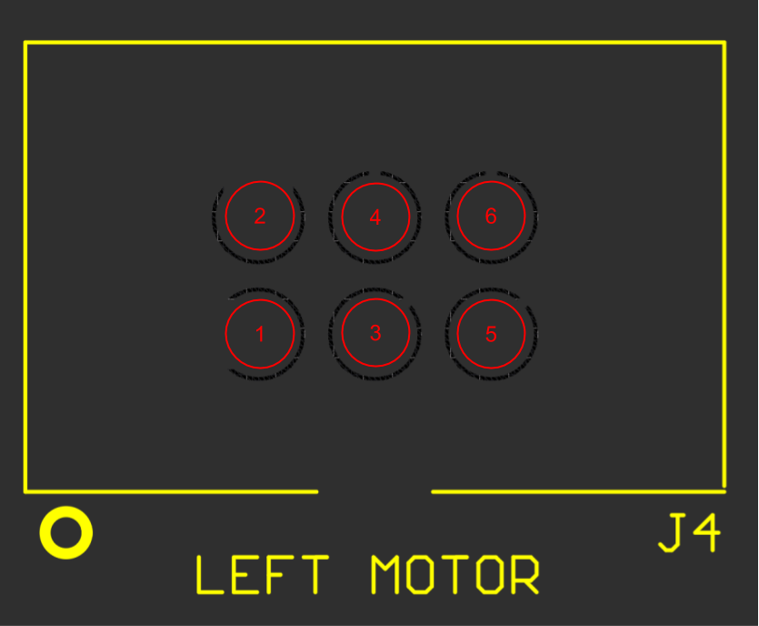

# PUFFER V4.0
Interfaces and drivers to control and monitor PUFFER hardware (motors, sensors).

* puffer_hardware: This metapackage for communicating with the robot
* puffer_common: This metapackage for message systems used on the PUFFER robot


- [PUFFER_V4.0](#PUFFER_V4.0)
	- [Software](#Software)
		- [Setup](#Setup)
			- [Creating Catkin WS](#creating_catkin_ws)
			- [Installing Dependencies](#installing_dependencies)
			- [DualShock Controller](#dualshock_controller)
		- [ROS Interface](#ros_interface)
			- [puffer_serial_driver](#puffer_serial_driver)
				- [rosparams](#rosparams)
				- [puffer_msgs](#puffer_msgs)
			- [Published Topics](#published_topics)
			- [Subscribed Topics](#subscribed_topics)
			- [Launch](#launch)
	- [Hardware](#Hardware)
		- [Overview](#overview)
		- [Components](#components)
		- [Connectors & Interfaces](#connectors_&_interfaces)
	- [Usage](#usage)
	- [Charging](#charging)
	- [Storage](#storage)
	- [Export Control](#export-control)
	- [License](#license)
-----


## Software

### Setup 
#### Creating Catkin ws
```
mkdir -p ~/catkin_ws/src
cd ~/catkin_ws
catkin build
```

#### Installing dependencies
The packages in this repository depend on the `PUFFER_common` package. To install it,
```
cd ~/catkin_ws/src/
git clone https://github-fn.jpl.nasa.gov/PUFFER/puffer_common.git
catkin)_make
```

#### DualShock Controller

  * Power on dualshock, holy playstation button and "share" until light flashes quickly
  * On the Raspberry Pi:
```
sudo bluetooth ctl

# agent on
# default-agent

# power on
# discoverable on
# pairable on
# scan on
# pair [mac-address]
(wait for RPi to ask you if you trust this device, and answer yes)
(if you don't wait, it freaks out later)
# trust [mac-address]
# quit

```
More information on this can be found at: 
[Dualshock pairing guide](https://wiki.gentoo.org/wiki/Sony_DualShock#DualShock_4)


-----
### ROS Interface
The ROS interface software can be found at **~/catkin_ws** . There are two ros packages in the **~/catkin_ws/src**

#### puffer_serial_driver
This package communicates with the PUFFER robot, you will find the scripts under 
**~/catkin_ws/src/puffer_hardware/puffer_serial_driver/scripts/**

* puffer.py : Creates the puffer ROS node 
* puffer_serial_driver.py : Communicates over UART to the RoboClaw motor controller
* dualshock.py : Runs PUFFER in a tele-op mode from the Playstation DUALSHOCK controller
* test_driver.py : PUFFER drive test file

##### rosparams
The following is the parameter list of the RosParams that are used in the PUFFER robot control

|   `Parameter namespace`   | `Parameter Name` |  `type` |    `value`   |                    `Description`                               |
|:---------------------|:-------|:----------|:-------------|:--------------------------------------------------------------------------| 
| motor_controllers/   | baud_rate         | int  | 115200       | Baudrate of UART communication     |
| motor_controllers/   | serial_device_name| int  | 1            | UART serial peripheral name |
| motor_controllers/   | address           | hex  | 0x80         | Serial address of motor controller |
| motor_controllers/battery/main/ | high   | float| 18.0         | High warning flag for main battery voltage |
| motor_controllers/battery/main/ | low    | float| 12.0         | Low warning flag for main battery voltage |
| motor_controllers/battery/logic/ | high  | float| 5.5          | High warning flag for logic battery voltage |
| motor_controllers/battery/logic/ | low   | float| 4.5          | Low warning flag for logic battery voltage |
| motor_controllers/m1/ | p                 | float| _X*_         | Proportional term for motor 1 tuning |
| motor_controllers/m1/ | i                 | float| _X*_         | Integral term for motor 1 tuning |
| motor_controllers/m1/ | d                 | float| _X*_         | Derivative term for motor 1 tuning |
| motor_controllers/m1/ | qpps              | float| _X*_         | Quadrature pulses per second for motor 1 |
| motor_controllers/m2/ | p                 | float| _X*_         | Proportional term for motor 2 tuning |
| motor_controllers/m2/ | i                 | float| _X*_         | Integral term for motor 2 tuning |
| motor_controllers/m2/ | d                 | float| _X*_         | Derivative term for motor 2 tuning |
| motor_controllers/m2/ | qpps              | float| _X*_         | Quadrature pulses per second for motor 2 |
| gpio_pins/            | e_stop            | int  | 18           | GPIO Pin that controls the E_STOP on motor controllers |
| gpio_pins/            | reg_en            | int  | 17           | GPIO Pin that control the 12V regulator |
| threadlock/           | timeout           | float| 0.1          | Timeout on threadlock error flag |
| wheels/               | diameter          | float| 0.19         | Diameter of Wheels in [meters] |
| wheels/encoder/       | cts_per_rev       | int  | 512          | Encoder counts per revolution of motor |
| wheels/encoder/       | factor            | float| 3.36652      | Empyrically derived scaling factor |
| wheels/gearbox/       | stage1            | int  | 63           | Gear reduction of gearbox stage 1|
| wheels/gearbox/       | stage2            | int  | 2            | Gear reduction of gearbox stage 2|
| wheels/gearbox/       | stage3            | float| 4.4444444444 | Gear reduction of gearbox stage 3|
| puffer/               | rate              | int  | 20           | Running frequency of communication to Motor controllers |
| puffer/               | max_vel_per_s     | float| 0.15         | Max linear translation velocity in [meters/s]|
| puffer/               | accel_const       | int  | 10           | Mulplicative factor of QPPS for Acceleration in [QP/s^2]
| dualshock/axes/       | left_control      | int  | 1            | Sets left wheel control from left thumbstick |
| dualshock/axes/       | right_control     | int  | 5            | Sets right wheel control from right thumbstick |
| dualshock/buttons/    | e_stop            | int  | 0            | Sets E_STOP button from controller to "X" |
| dualshock/buttons/    | fan               | int  | 2            | Sets Fan control button from controller to "Triangle" |

 
__X*__ : These are filled in as the robot is running.

-----
	
#### Puffer_msgs

|  `Message name`        |  `data type`     | `field name`   |
|:-----------------------|:-----------------|:---------------|
| `MotorCommand`         |                  |                |
|                        | float64 | motor_angular_velocity_rad_s| 
| `MotorEncoder`         |                  |                |
|                        | float64 | angular_velocity_rad_s  |
|                        | uint64 | angular_position_measurement_time |
|                        | float64 | angular_velocity_rad_s  |
|                        | uint64 | angular_velocity_measurement_time |
| `MotorControllerStatus`|                  |                |
|                        | float64 | voltage |
|                        | float64 | temperature |
|                        | uint64  | roboclaw_error |
|                        | float64 | left_motor_current |
|                        | float64 | right_motor_current |
|                        | float64 | left_motor_integrator |
|                        | float64 | right_motor_integrator |
|                        | float64 | max_left_integrator |
|                        | float64 | max_right_integrator |
|                        | uint8_t | e_stop_state |
|                        | uint8_t | reg_state |
| `PeripheralControl`    |         |                          |
|                        | uint8_t | e_stop |
|                        | uint8_t | fan |

-----

#### Published Topics

|   `Name`       | `Message Type`          |
|:---------------|:------------------------|
| `encoders`     | `Encoder`               |
| `puffer_state` | `MotorControllerStatus` |
| `peripheral_cmd`| `PeripheralControl`    |

The `/encoders` topic publishes the encoder data coming from the left and right wheel. Data is in [rad/s]

The `/puffer_state` topic publishes state information about the robot, including motor controller data, battery charge, and current checks

The `/peripheral_cmd` topic publishes commands for the 12V regulator (controls the cooling fan) and the E_STOP software controlled line to stop the robot in case of unsafe conditions

For more information on each of the topic consult the source code for each of the messages

-----

#### Subscribed Topics

|   `Name`         | `Message Type`      |
|:-----------------|:--------------------|
| `vel_cmd`        | `WheelVelCmd`       |
| `peripheral_cmd` | `PeripheralControl` |

The `/vel_cmd` topic is what you publish to for control of the robot, in [rad/s], for each of the two wheels

The `/vel_cmd` topic is what you publish to for control of the 12V regulator (controls the cooling fan) and the E_STOP software controlled line to stop the robot in case of unsafe conditions

-----

#### Launch
There is a launch file to start the PUFFER robot, as well as the node to listen to the dualshock controller at: **~/catkin_ws/src/puffer_hardware/puffer_serial_driver/scripts/**. This can be ran with `roslaunch puffer_serial_driver puffer.launch`

-----

## Hardware

### Overview 
The Puffer V4.0 P/N 10430419-1 REV-A is the control PCB for the PUFFER V4.0 robot. It's purpose is to allow an easy-plug-in interface to a lot of the consumer parts (control board, motor controller, motors, regulators etc.). It has simple circuit protection as well to keep the individual electronic components safe from various conditions, detailed below.

| **Parameter** | **Range** | **Units** | **Safety Description** |
| :---------------|:------------|:------------| :------------------------|
|      Voltage    | 13.2 - 17.8 | [V]         | Over/under voltage shutoff|
|      Current    | 7-10        | [A]         | Over current, soft cutoff until power cycle |
|      Current    | >10         | [A]         | Over current, hard cutoff, fuse blow |

The Puffer V4.0 robot was designed to use a 14.8V Li-ion battery, in which these operating specs are tightened around the operation of that battery a bit as well. It can be tested from a power supply as long as the voltage and current levels are within the above specs. 


-----

### Components


| **Reference Des** | **Component Description** |
|:--------------|:------------|
| T1            | 5V Regulator|
| T2            | 12V Regulator|
| F1            | Protection Fuse |
| RC1           | RoboClaw Motor controller |
| J9            | Jetson Nano |

----- 
### Connectors & Interfaces


| Reference Designator | Connector Description |
|:--------|:------------|
| J1      | Battery input to PCB |
| J2      | Nano communication to PCB |
| J3      | Right motor/encoder  |
| J4      | Left motor/encoder   |
| J5      | Motor controller power/motor phase |
| J6      | LED Headers          |
| J7      | Fan Header (+12V)    |
| J8      | I2C Header from Nano |
| J9      | Jetson Nano standoffs |
| J10     | Misc 12V header      |
| J11     | Power Switch         |
| J12     | Misc 5V header       | 

-----

#### J1 Power Connecter

J1 Connector is the input of the Battery voltage to the entire robot. 


<center>

| Pin Number | Description |
|:-----------|:------------|
| 1          | + Battery Voltage |
| 2          | - Battery Voltage |

</center>

<p align="center">

</p>

-----


#### J2 Jetson Communication Connector

J2 Connector runs power to the Jetson nano, as well as runs all the GPIO, Serial, and I2C communication to the PCB/Robot. 

| Pin Number | Description |
|:-----------|:------------|
| 1          | +3.3V       |
| 2          | +5V         |
| 3          | SDA         |
| 4          | +5V         |
| 5          | SCL         |
| 6          | GND         |
| 7          | GPIO216     |
| 8          | TxD         |
| 9          | GND         |
| 10         | RxD         |
| 11         | REG_ENABLE  |
| 12         | ESTOP_S     |
| 13         | GPIO27      |
| 14         | GND         |

<p align="center">

</p>

-----

#### J3 Right Motor/Encoder Connector

J3 Connector is the motor and encoder connector for the right wheel

| Pin Number | Description |
|:-----------|:------------|
| 1          | Motor 1 phase A |
| 2          | Motor 1 phase B |
| 3          | Encoder GND     |
| 4          | Encoder +Vcc (5V) |
| 5          | Encoder Signal A|
| 6          | Encoder Signal B|

<p align="center">

</p>

-----

#### J4 Left Motor/Encoder Connector

J4 Connector is the motor and encoder connector for the left wheel

| Pin Number | Description |
|:-----------|:------------|
| 1          | Motor 2 phase A |
| 2          | Motor 2 phase B |
| 3          | Encoder GND     |
| 4          | Encoder +Vcc (5V) |
| 5          | Encoder Signal A|
| 6          | Encoder Signal B|

<p align="center">

</p>
-----

#### J5 RoboClaw Connector

J5 Connector runs the Battery voltage to the motor controller, and both motor phases into the PCB from the motor controller

| Pin Number | Description |
|:-----------|:------------|
| 1          | Motor 1 Phase B|
| 2          | + Battery |
| 3          | Motor 2 Phase B|
| 4          | Motor 1 Phase A|
| 5          | - Battery |
| 6          | Motor 2 Phase A|

<p align="center">

</p>

-----

#### J6 LED Header Connector

J6 Connector is a header pin for the LEDs on the back of the robot. During normal operation the Battery LED and FAULT LED should be ON. the FAULT LED will turn OFF if the circuit protection in the system has tripped, which would happen if it runs into an over-current, over-voltage, or under-voltage constraint ( see [overview](#overview) )

| Pin Number | Description |
|:-----------|:------------|
| 1          | GPIO216     |
| 2          | GND         |
| 3          | FAULT       |
| 4          | GND         |
| 5          | +Battery    |
| 6          | GND         |
| 7          | GPIO27      |
| 8          | GND         |

<p align="center">

</p>

-----

#### J7 Fan Header Connector

J7 Connector is a +12V header pin to run power to the cooling fan

| Pin Number | Description |
|:-----------|:------------|
| 1          | +12V        |
| 2          | GND         |

<p align="center">

</p>

-----

#### J8 I2C Header Connector

J8 Connector is the I2C header from the Jetson nano. This is to run to the LCD screen

| Pin Number | Description |
|:-----------|:------------|
| 1          | +3.3V       |
| 2          | SDA         |
| 3          | SCL         |
| 4          | GND         |

<p align="center">

</p>

-----


#### J10 Misc +12V Header Connector

J10 Connector is a misc 12V connector for usage. It has about 2 [Amps] of spare overhead current on the regulator

| Pin Number | Description |
|:-----------|:------------|
| 1          | +12V        |
| 2          | GND         |

<p align="center">

</p>

-----

#### J11 Power Switch Connector

J11 Connector runs the batter voltage through the switch to the power the rest of the robot

| Pin Number | Description |
|:-----------|:------------|
| 1          | COMM        |
| 2          | N/O         |

<p align="center">

</p>

-----

#### J12 Misc +5V Header Connector

J12 Connector is a misc 5V connector for usage. It will be okay to use in the up to 2 [Amp] range, the regulator has much more overhead left on what it can produce, but the header pin current limit will be the limiting factor.

| Pin Number | Description |
|:-----------|:------------|
| 1          | +5V         |
| 2          | GND         |

<p align="center">

</p>

-----

### Charging
TODO -ADD PICTURES/INFORMATION OF STORING PUFFER

-----

### Storage
TODO - ADD PICTURES OF STORAGE IN PELICAN CASE


-----


## Export Control

The technical data in this document is controlled under the U.S. Export Regulations; release to foreign persons may require an export authorization.

-----
## License

```
Copyright 2019, by the California Institute of Technology.
ALL RIGHTS RESERVED. United States Government Sponsorship 
acknowledged. Any commercial use must be negotiated with the Office 
of Technology Transfer at the California Institute of Technology.

This software may be subject to U.S. export control laws. By
accepting this software, the user agrees to comply with all
applicable U.S. export laws and regulations. User has the
responsibility to obtain export licenses, or other export authority
as may be required before exporting such information to foreign
countries or providing access to foreign persons.
```

